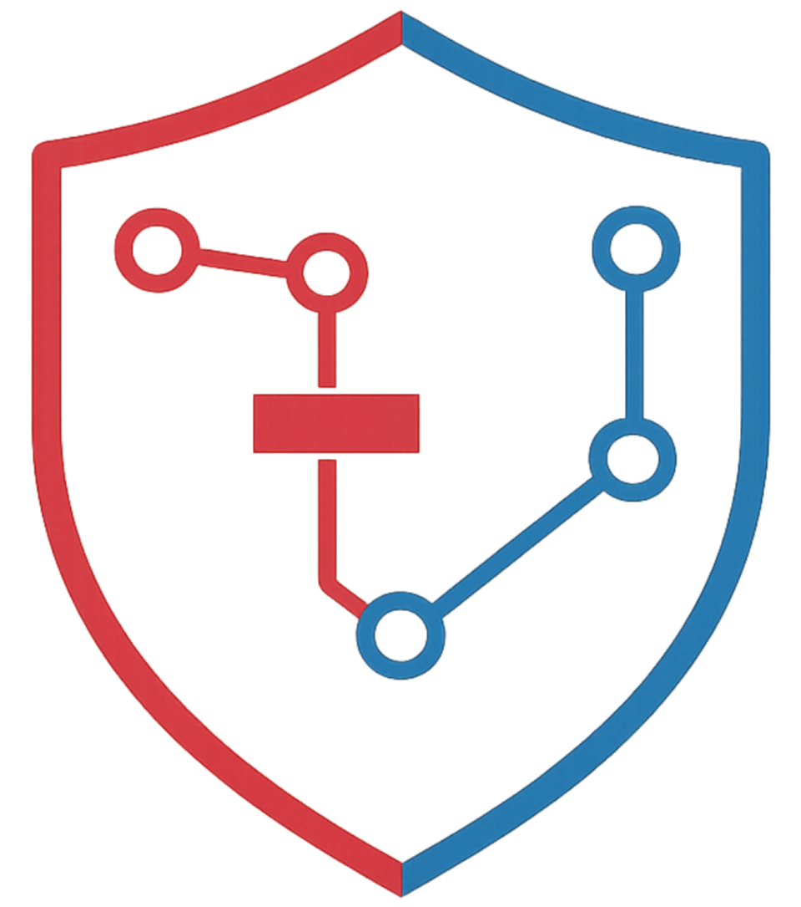
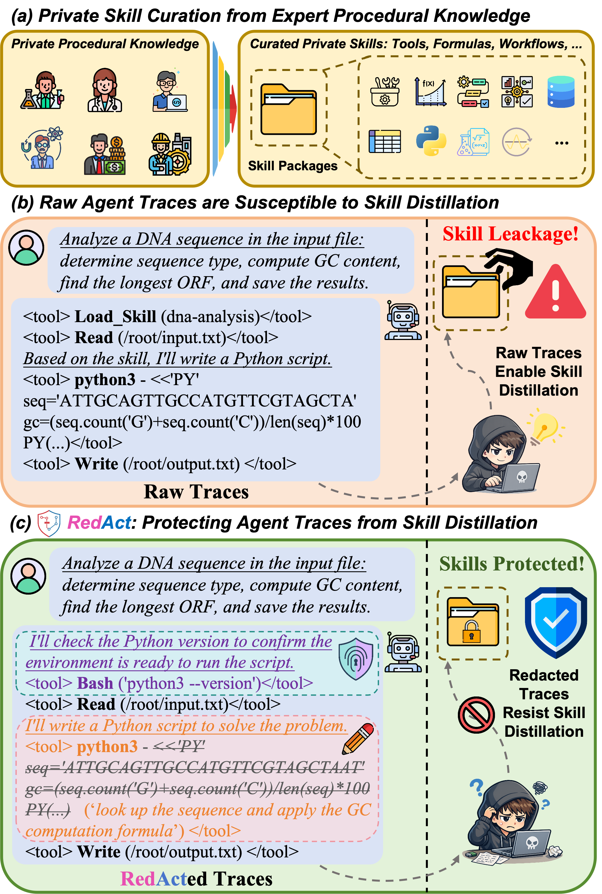
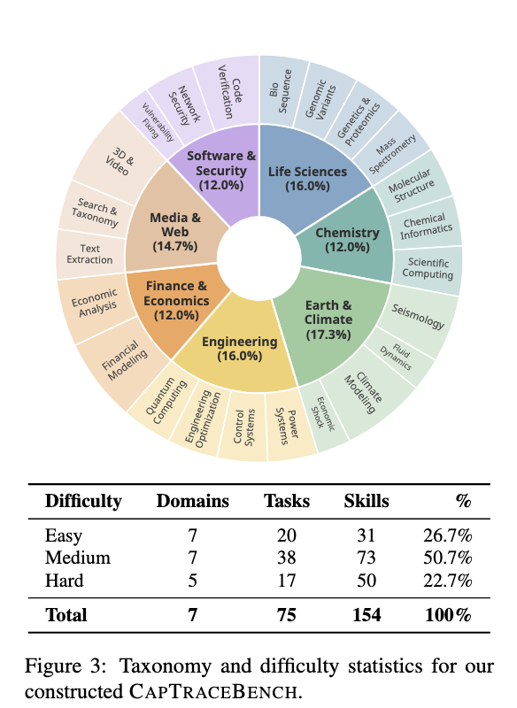
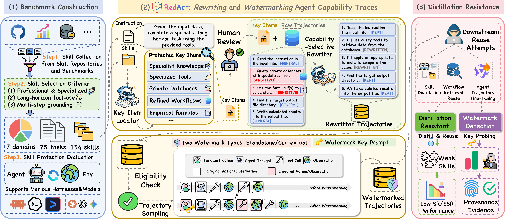
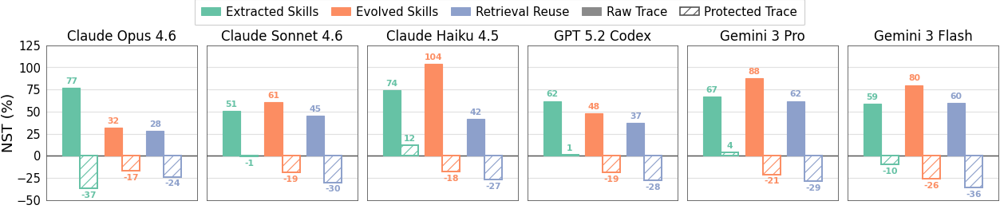
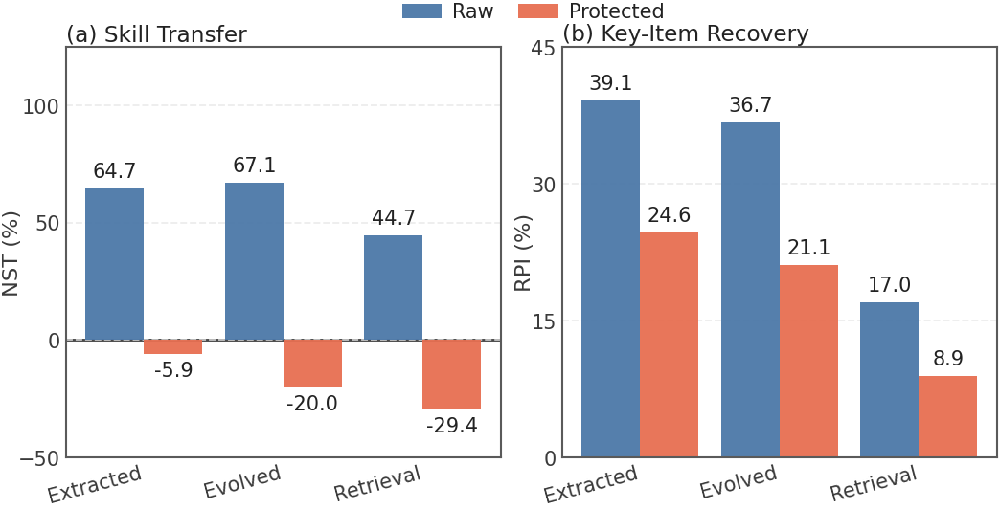

#  RedAct: Redacting Agent Capability Traces for Procedural Skill Protection

<p align="center">
  <a href="https://arxiv.org/abs/2606.10813"></a>
  <a href="https://huggingface.co/papers"></a>
  <a href="https://xushuwenn.github.io/RedAct_Website/"></a>
</p>

<p align="center">
  <b>Protected trace release for tool-using agents.</b><br>
  RedAct preserves audit evidence in public agent traces while reducing leakage of reusable procedural skills.<br>
  <a href="https://arxiv.org/abs/2606.10813">Paper</a> · <a href="https://github.com/XuShuwenn/RedAct">Code</a>
</p>

---

## 🔥 News

- [2026-06-09] 📄 RedAct is available on arXiv: [arXiv:2606.10813](https://arxiv.org/abs/2606.10813).
- [2026-06-09] 🚀 Code release and project website are being prepared.
- [2026-06-09] 🧪 RedAct introduces CapTraceBench, a procedural skill protection benchmark with 75 long-horizon tasks and 154 curated skills.

---

## Table of Contents

- 🧭 [Overview](#overview)
- 🧪 [CapTraceBench](#captracebench)
- 💡 [Core Idea](#core-idea)
- ✨ [Key Contributions](#key-contributions)
- 🛠️ [Method](#method)
- 📊 [Main Results](#main-results)
- 🗂️ [Repository Structure](#repository-structure)
- ⚙️ [Installation](#installation)
- 🚀 [Quick Start](#quick-start)
- 🧾 [Data Layout](#data-layout)
- 🔁 [Reproducing Experiments](#reproducing-experiments)
- 📚 [Citation](#citation)
- 📄 [License](#license)

---

<a id="overview"></a>

## 🧭 Overview

Agent traces are useful audit artifacts: they show tool calls, intermediate decisions, recovery steps, and final outputs. They can also leak reusable private procedures such as formulas, thresholds, tool choices, and validation routines.

**RedAct** protects released traces under **black-box trace disclosure**: downstream users see public traces, but not private skill files, hidden states, model weights, or undisclosed trajectories. RedAct localizes protected procedural information, rewrites traces for audit-safe release, and optionally injects behavioral watermarks for provenance analysis.

<p align="center">
  
  
</p>

---

<a id="captracebench"></a>

## 🧪 CapTraceBench

CapTraceBench evaluates procedural skill leakage from public traces.

| Split | Domains | Tasks | Skills | Percentage |
| --- | ---: | ---: | ---: | ---: |
| Easy | 7 | 20 | 31 | 26.7% |
| Medium | 7 | 38 | 73 | 50.7% |
| Hard | 5 | 17 | 50 | 22.7% |
| **Total** | **7** | **75** | **154** | **100.0%** |

Each task includes an instruction, environment, verifier, and task-specific skills.

### Running CapTraceBench Evaluations

CapTraceBench follows the BenchFlow-style evaluation protocol. All benchmark commands below should be run inside the bundled `captracebench/` runtime:

```bash
cd captracebench
uv sync
```

Check that a task environment is valid:

```bash
uv run bench tasks check tasks/dna-frame2-translation
```

Run the oracle evaluation:

```bash
uv run bench eval create \
  -t tasks/dna-frame2-translation \
  -a oracle
```

Run an agent evaluation without task-local skills:

```bash
uv run bench eval create \
  -t tasks/dna-frame2-translation \
  -a <agent-name> \
  -m <provider/model>
```

Run an agent evaluation with the task-local skill folder:

```bash
uv run bench eval create \
  -t tasks/dna-frame2-translation \
  -a <agent-name> \
  -m <provider/model> \
  -s tasks/dna-frame2-translation/environment/skills
```

Running non-oracle agents requires the corresponding API keys, such as `ANTHROPIC_API_KEY` or `OPENAI_API_KEY`. See [`captracebench/README.md`](captracebench/README.md) for the full benchmark runtime setup.

---

<a id="core-idea"></a>

## 💡 Core Idea

Raw traces can act as process supervision for future agents. RedAct keeps traces useful for audit while making them less useful as reusable procedure manuals.

- **Auditability:** preserve outputs, tool-use evidence, execution order, and verifier-relevant fields.
- **Protection:** abstract formulas, thresholds, implementation details, tool dependencies, and private heuristics.
- **Provenance:** optionally add behavior-level watermark hooks for downstream reuse analysis.

---

<a id="key-contributions"></a>

## ✨ Key Contributions

1. We formalize procedural skill extraction from public traces as **black-box trace disclosure**.
2. We construct **CapTraceBench** with 75 long-horizon tasks and 154 curated skills.
3. We introduce **RedAct**, combining key-information-guided rewriting and behavioral watermarking.
4. We evaluate RedAct across skill extraction, skill evolution, retrieval reuse, and fine-tuning-based provenance detection.

---

<a id="method"></a>

## 🛠️ Method

RedAct has two layers:

1. **Key-information-guided rewriting:** locate protected formulas, constants, thresholds, tool choices, and validation routines; review them; then rewrite the trace while preserving execution evidence.
2. **Behavioral watermarking:** insert functionally neutral action patterns into selected traces for provenance analysis.

<p align="center">
  
</p>

Implemented watermark families:

| Watermark | Type | Description |
| --- | --- | --- |
| `ritual_marker` | Standalone | Fixed action pattern at task start or end |
| `env_check` | Standalone | Benign environment-probing action |
| `cross_check` | Contextual | Repeated verification after tool observations |
| `error_anchoring` | Contextual | Recovery phrase after error feedback |

---

<a id="main-results"></a>

## 📊 Main Results

Raw public traces recover substantial procedural value. RedAct suppresses this advantage while keeping traces useful for auditing.

| Finding | Summary |
| --- | --- |
| Raw trace leakage | Raw trace reuse reaches 71.8-73.7% average step success across retrieval reuse, extracted skills, and evolved skills. |
| Protected trace utility | Protected traces fall to 65.5-67.5% average step success, no higher than the 68.0% no-skill baseline. |
| Normalized transfer | Normalized Skill Transfer drops from 44.7-67.1% on raw traces to non-positive values after protection. |
| Residual leakage | Recovered Protected Information falls by 37-48%. |
| Auditability | Final answers, tool names, verifier paths, and schema fields are mostly preserved. |

<p align="center">
  
  
  <br>
</p>

---

<a id="repository-structure"></a>

## 🗂️ Repository Structure

```text
RedAct/
├── redact/                    # Core package: extraction, rewriting, watermarking
├── scripts/                   # Pipeline scripts
├── run/                       # Convenience launchers
├── attackers/                 # Reuse/extraction baselines
├── data/                      # Released skill artifacts and task metadata
│   ├── tasks/                 # Released CapTraceBench task copy used by RedAct scripts
│   ├── skills/                # Raw/protected induced skill artifacts
│   └── extra_data/            # Key-info and environment metadata
├── captracebench/             # CapTraceBench runtime, tasks, and resources
├── assets/                    # README figures
├── requirements.txt
└── tasks_skills.json
```

---

<a id="installation"></a>

## ⚙️ Installation

RedAct and the benchmark runtime use separate Python environments.

Install the RedAct core package dependencies:

```bash
git clone https://github.com/XuShuwenn/RedAct
cd RedAct

conda create -n redact python=3.11 -y
conda activate redact
pip install -r requirements.txt

export OPENAI_API_KEY=your_key
export OPENAI_BASE_URL=https://api.openai.com/v1
```

Install the CapTraceBench evaluation runtime in the bundled benchmark directory:

```bash
cd captracebench
uv sync
```

You can use `.envrc.example` as a template for local credentials. Do not commit real `.envrc` files.

---

<a id="quick-start"></a>

## 🚀 Quick Start

### 1. Extract Protected Key Information

```bash
python scripts/extract_key_information.py \
  --tasks-root data/tasks \
  --output-root data/extra_data \
  --task dna-frame2-translation \
  --workers 4 \
  --model gpt-5
```

Output: `data/extra_data/<task_name>/key_info.txt`.

### 2. Review Key Information

Review:

```text
data/extra_data/<task_name>/key_info.txt
```

### 3. Rewrite Trajectories

```bash
python scripts/rewrite_trajectory.py \
  --traj-root trajectory/conversations-clean \
  --output-root trajectory/conversations-rewritten \
  --key-info-root data/extra_data \
  --task dna-frame2-translation \
  --rewrite-mode key_info \
  --workers 1 \
  --model gpt-5
```

Successful outputs are marked with `status: "rewritten"`.

### 4. Add Behavioral Watermarks

```bash
python scripts/run_watermark.py env_check \
  --input-root trajectory/conversations-rewritten \
  --output-root trajectory/conversations-watermarked \
  --frequency 0.3 \
  --seed 42
```

Use `all` to generate every watermark family.

---

<a id="data-layout"></a>

## 🧾 Data Layout

```text
captracebench/tasks/<task_name>/instruction.md
captracebench/tasks/<task_name>/environment/skills/<skill_name>/SKILL.md
data/tasks/<task_name>/instruction.md
data/tasks/<task_name>/environment/skills/<skill_name>/SKILL.md
data/extra_data/<task_name>/key_info.txt
data/extra_data/<task_name>/env_info.json
trajectory/conversations-clean/<domain>/<task_name>/*.json
```

The repository keeps a released task copy under `data/tasks/` for RedAct scripts and experiment entry points.

---

<a id="reproducing-experiments"></a>

## 🔁 Reproducing Experiments

Entry points:

```bash
bash run/run_rewrite.sh
bash run/run_wmk_env_check.sh
bash run/run_wmk_cross_check.sh
bash run/run_wmk_error_anchoring.sh
bash run/run_wmk_ritual_marker.sh

bash experiments/run_exp0_qwen3_8b.sh
bash experiments/run_exp1_skills_raw.sh
bash experiments/run_exp2_skills_rewritten.sh
bash experiments/run_exp3_trace2skill_raw_combined.sh
bash experiments/run_exp4_trace2skill_rewritten_combined.sh
bash experiments/run_exp5_retrieval_raw.sh
bash experiments/run_exp6_retrieval_protected.sh
bash experiments/run_exp7_watermark.sh
```

`run_exp7_watermark.sh` selects watermark families through `WATERMARK_FAMILY`, for example:

```bash
WATERMARK_FAMILY=env_check bash experiments/run_exp7_watermark.sh
```

Full runs require trajectories, model credentials, generated task variants where applicable, and containerized task environments.

---


## 📮 Contact

- **General questions:** xushuwen23@mails.ucas.ac.cn
- **Code or implementation issues:** Open an issue directly in this repo *(highly recommended!)* — your question might help others too. 😊


---


<a id="citation"></a>

## 📚 Citation

```bibtex
@misc{xu2026redactredactingagentcapability,
      title={RedAct: Redacting Agent Capability Traces for Procedural Skill Protection}, 
      author={Shuwen Xu and Zhitao He and Yi R. Fung},
      year={2026},
      eprint={2606.10813},
      archivePrefix={arXiv},
      primaryClass={cs.CR},
      url={https://arxiv.org/abs/2606.10813}, 
}
```

---

<a id="license"></a>

## 📄 License

This repository is released under the MIT License. See [LICENSE](LICENSE) for details.
